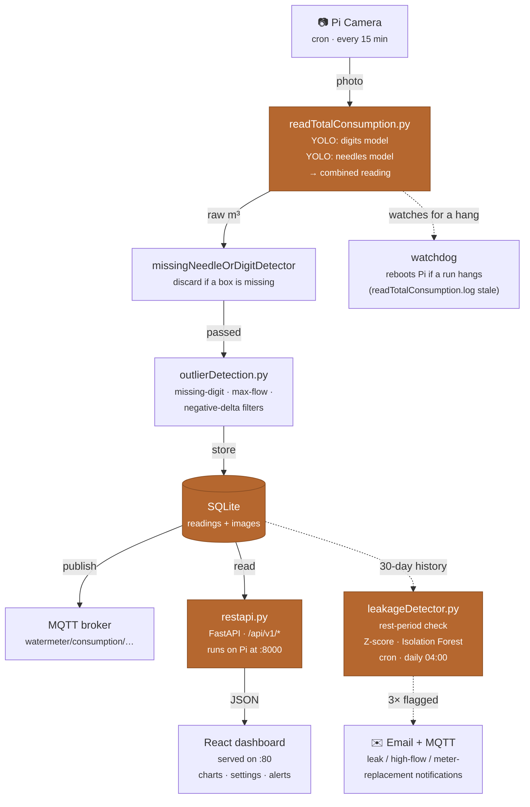

# WatermeterAI NextGen 💧

Turns a photo of an ordinary analog water meter into a continuous digital reading — no smart meter, no retrofit, just a Raspberry Pi, a camera, and a YOLO model reading the dials the way a person would.


Every 15 minutes, a camera photographs the meter's dial face. A pair of YOLO object-detection models reads the digit wheels and the sweep needles the same way a human eye would — by locating each digit and each needle position in the frame — and combines them into one cumulative consumption value. That value is filtered for outliers, stored, and pushed to a dashboard and an MQTT broker. A separate nightly job watches the trend for the signature of a leak — flow that never stops or exhaustive flows — and emails a warning before it becomes a water bill.

## Credits

This project was inspired by [jomjol/AI-on-the-edge-device](https://github.com/jomjol/AI-on-the-edge-device), which pioneered reading analog utility meters with on-device machine learning on an ESP32. WatermeterAI NextGen takes a different path to the same problem: a fire-and-forget setup built around a Raspberry Pi's extra headroom, modern YOLO object detection instead of digit-segment classification, and a purpose-designed diffused LED light source that avoids glare — aiming for reliably accurate readings straight out of the box, with no per-install calibration.

## Contents

- [WatermeterAI NextGen 💧](#watermeterai-nextgen-)
  - [Credits](#credits)
  - [Contents](#contents)
  - [How it works](#how-it-works)
  - [Model training](#model-training)
  - [Repository layout](#repository-layout)
  - [Hardware](#hardware)
    - [What it costs](#what-it-costs)
  - [Installation](#installation)
  - [Local development](#local-development)
  - [Configuration reference](#configuration-reference)
  - [Leak detection](#leak-detection)
  - [Known limitations](#known-limitations)
  - [License](#license)

## How it works



*The reading pipeline (solid arrows) runs every 15 minutes; the leak detector (dashed arrows) runs once nightly against 30 days of stored readings and only speaks up after three consecutive flagged days. A watchdog independently reboots the Pi if a run ever hangs mid-inference.*

**The reading pipeline.** `readTotalConsumption.py` fires from cron every 15 minutes, snaps a photo, and runs it through two YOLO11 models: one trained on the meter's rotating digit wheels, one on its sweep needles and the counter's bounding area. Both YOLO reads are turned into an integer by concatenating each detected box's class digit in position order, straight from the raw detected classes. On the physical meter, the digit wheels after the decimal point are printed red, so an HSV color analysis (`sum_red_pixels`) sums red pixels inside each digit box and an MAD-based outlier check counts how many of the trailing wheels are red. That count is exactly how many places the decimal point sits from the right, applied by dividing the digit read by a matching power of 10 (`identifyRedDigitsCorrectionFactor`) — the red-pixel detection is what tells the code where the fractional part starts, not something it discards. The needle read's correction factor is shifted by the same count before the two partial reads are combined into one cumulative m³ value.

**Outlier filtering.** Camera misreads happen — a shadow, a reflection, a wheel the model half-sees. Before a value is even computed, `missingNeedleOrDigitDetector` compares this frame's detected needle/digit box count against the count learned from recent successful readings and discards the frame outright if one is missing (catches the case where a badly-lit needle would otherwise silently shift every remaining digit by a power of ten). Three more filters then run in sequence on the accepted value: a missing-digit detector, a max-flow detector (rejects any single-step jump that's physically impossible for the plumbing — both as a rate and as an absolute cap, so a burst of dropped intermediate readings can't smuggle a large jump through), and a negative-delta detector (the meter can only count up, with an explicit exception path for a confirmed physical meter replacement). A single rejected value falls back to the reading's own local median rather than being dropped outright, so the time series stays continuous — but if several consecutive raw readings keep agreeing on a new, higher value, the max-flow filter accepts it as a genuine sustained high flow (e.g. a pipe burst) instead of clamping it forever, and raises a notification.

**Storage and delivery.** Accepted readings land in SQLite (via [peewee](https://github.com/coleifer/peewee)) alongside the annotated source image and every intermediate pipeline value, then get published to an MQTT topic for anyone already wired into home-automation tooling (Home Assistant, Node-RED, …). The FastAPI backend reads the same database to serve the dashboard: consumption by day/month/year, cost-rate deltas, and a settings/notifications API. A developer mode exposes each pipeline stage as its own selectable line on the readings chart, for diagnosing exactly which filter changed a given value.

## Model training

The two YOLO11 models in `backend/models/` were trained on a dataset of **3,516 images** pulled together from several sources to cover as wide a range of meter appearances, lighting, and camera angles as possible: photos sourced from around the web, synthetically generated dial images, and composited images (real meter backgrounds with digit/needle overlays assembled programmatically). That mix was deliberate — a model trained only on one meter model or one lighting setup would overfit to it and fail on anyone else's hardware.

| Model | Task | Precision | Recall | mAP50 | mAP50-95 | Epochs |
|---|---|---|---|---|---|---|
| `totalandneedles/best.pt` | Needle position + counter-area detection | 0.894 | 0.882 | 0.906 | 0.852 | 100 |
| `digits/best.pt` | Digit-wheel detection (0–9 + red/transition class) | 0.964 | 0.908 | 0.948 | 0.826 | 100 |

Both were trained with Ultralytics YOLO11 for 100 epochs. The higher digit-detection precision (0.96 vs. 0.89) reflects that digit wheels are a more visually consistent target — ten similar-looking classes on a flat printed wheel — while needle position and the counter-area box have more geometric variation across meter models. In practice, the two models' errors are largely independent, which is part of why the outlier filters downstream (see below) catch the cases either model gets wrong on its own.

If you're retraining for a different meter design, keep the same split: one model for the sweep needles / counter-area, one for the digit wheels. Training scripts and the raw dataset aren't included in this repository (the raw images are ~a few GB), but the class layout and label format follow standard Ultralytics YOLO conventions, so any YOLO-compatible labeling/training pipeline (e.g. [Roboflow](https://roboflow.com) or a local [Ultralytics](https://docs.ultralytics.com/) setup) will work.

## Repository layout

| Path | What lives there |
|---|---|
| `backend/` | FastAPI server, YOLO reading pipeline, leak detector, SQLite models |
| `backend/models/` | Trained YOLO11 weights (digits, needles+counter-area) |
| `backend/tests/` | Pytest suite — pure-function tests + a DB-backed integration test |
| `frontend/` | React + Vite dashboard (readings, charts, settings, notifications) |
| `hardware/led/` | KiCad schematic + PCB for the diffused LED illumination board |
| `mechanics/` | FreeCAD models for the camera/light 3D-printed mounting bracket |
| `setupscript.sh` | Provisions a fresh Pi: swap, services, cron, watchdog, `.env` |

## Hardware

`Raspberry Pi Zero 2 W (or better)` · `Pi Camera Module` · `Custom diffused LED light (KiCad)` · `3D-printed mount (FreeCAD)`

The camera and a purpose-built LED-with-diffusor light source (schematic and PCB in [`hardware/led/`](hardware/led/)) sit inside a 3D-printed bracket ([`mechanics/`](mechanics/)) that clips over the meter's existing glass face — no plumbing work, no meter replacement. The diffusor exists because water meter cellars are dark and a bare LED against the meter's glass face causes harsh glare and reflections, which is the single biggest source of misreads; it fires briefly before each capture.

### What it costs

The compute and imaging side of this is deliberately cheap — the accuracy comes from the YOLO models and the diffused lighting, not from expensive hardware:

| Part | Price |
| --- | --- |
| Raspberry Pi Zero 2 W | ~€20 / $15 |
| Camera module (e.g. RPIZ-CAM-GS) | ~€15 |
| **Total (board + camera)** | **~€35 / ~$40** |

On top of that you'll need a power supply, an SD card, the LED/diffusor and a 3D-printed bracket (a few euros in parts, see [`hardware/`](hardware/) and [`mechanics/`](mechanics/)) — realistically well under €50 all in, a fraction of what a comparable smart-meter retrofit costs. Prices fluctuate by retailer and availability; check current listings before buying.

> **Reproducing the hardware:** The PCB and enclosure files are provided as-is for reference and reproduction. You'll need a KiCad install to review/fabricate `hardware/led/led.kicad_pcb`, and FreeCAD for the `mechanics/*.FCStd` models. Expect to adapt the bracket geometry to your own meter model — glass diameter and depth vary by manufacturer.

## Installation

The intended target is a fresh Raspberry Pi OS install (Bullseye or newer, 64-bit recommended for `torch`/`ultralytics`).

```bash
git clone <this-repo-url> watermeter
cd watermeter
sudo bash setupscript.sh
```

`setupscript.sh` is idempotent-ish but not fully — read it before running it a second time. It will:

1. Increase swap to 2 GB (YOLO inference is memory-hungry on a Pi Zero 2)
2. Install system packages (`python3-picamera2`, `zbar-tools`, `npm`, `watchdog`)
3. Create a Python venv and install the pinned backend dependencies
4. Write `/home/admin/watermeter/.env` with the paths the backend expects
5. Register two `systemd` services (`watermeter_restapi`, `watermeter_frontend`) and three cron jobs (measurement every 15 min, leak check nightly, DB cleanup nightly)
6. Configure a hardware watchdog that reboots the Pi if the reading log goes stale for 15 minutes

Build the frontend once, so the systemd service has something to serve:

```bash
cd frontend
npm install
npm run build   # outputs to frontend/dist, served by `serve` on :80
```

On first boot with no WiFi configured, `backend/wifi.py` runs at startup and waits for a WiFi-credentials QR code (the kind printed on a router, or generated by any "share WiFi" phone feature) to be shown to the camera — no keyboard or monitor needed for initial setup.

## Local development

You don't need a Pi or a camera to work on the dashboard or the API. `requirements.txt` covers everything except the camera/YOLO pipeline:

```bash
cd backend
python3 -m venv .venv && source .venv/bin/activate
pip install -r requirements.txt

cp .env.example watermeter/.env   # see Configuration reference below
python seed_dev_data.py           # optional: populate SQLite with sample readings
python restapi.py                 # → http://localhost:8000/api/v1
```

```bash
cd frontend
npm install
npm run dev                       # → http://localhost:5173
```

Run the test suite with:

```bash
cd backend
pytest
```

`requirements-pi.txt` (`ultralytics`, `torch`, `opencv-python`, `pyzbar`, `Pillow`) is only needed if you're working on the actual image-reading pipeline — install it alongside `requirements.txt` on hardware that can run YOLO inference.

### Verifying a deploy

Every frontend build stamps itself with the short git commit hash it was built from (plus a `-dirty` suffix if the working tree had uncommitted changes), via `git rev-parse --short HEAD` in [`frontend/vite.config.js`](frontend/vite.config.js) at build time — no manual version bumping. It's shown at the bottom of the dashboard sidebar. After running `deploy.sh`, compare that against `git rev-parse --short HEAD` locally to confirm the Pi actually picked up the latest build.

## Configuration reference

Both the backend (`.env`, via `python-dotenv`) and the runtime settings (`settings.json`, via the `/api/v1/settings` endpoint) hold configuration that's specific to your install and is deliberately excluded from version control.

| File | Holds | Set by |
|---|---|---|
| `watermeter/.env` | Filesystem paths — DB file, image folder, log folder, model weight paths | `setupscript.sh` on install |
| `data/settings.json` | MQTT broker credentials, SMTP credentials | Dashboard's Settings page, or manually on first run |

> **Network exposure:** The REST API ships with permissive CORS (`allow_origins=["*"]`) and no authentication — it's built to run on a trusted home LAN, reachable from the dashboard and nothing else. Don't port-forward `:8000` or `:80` to the public internet without putting a reverse proxy with auth in front of them.

## Leak detection

`leakageDetector.py` runs once nightly and combines three independent signals, because a slow leak, a stuck-open valve, and a burst pipe each leave a different signature in the reading history:

| Check | Catches | How |
|---|---|---|
| Rest-period check | Flow that never fully stops in 24h | Looks for any window where consecutive readings stay within an adaptive noise threshold |
| Z-score model | A quiet-hour slot (e.g. 3am) running unusually high | Compares each time-of-day slot's rolling 30-min sum against its own 30-day distribution |
| Isolation Forest | Unusual combinations — steady flow at an odd hour, an odd-sized single spike | Unsupervised model trained on flow, streak length, and time-of-day features |

A single flagged night doesn't trigger a warning — three consecutive nights do, via a debounce counter in the database. This trades a day or two of detection latency for not emailing you every time someone runs the dishwasher at an odd hour.

## Known limitations

- Reading accuracy depends on consistent lighting and a clean meter face — condensation, dirt, or an off-angle mount will degrade YOLO's confidence.
- The two YOLO models bundled in `backend/models/` were trained on one specific meter's dial design; a differently styled meter (different digit font, needle layout) will very likely need retraining.
- No authentication on the API or dashboard — see the CORS callout above.
- The Pi Zero 2 W is workable but slow for inference; a Pi 4/5 gives noticeably faster capture-to-reading latency.

## License

Backend and hardware design files: MIT — see [`LICENSE`](LICENSE).

The frontend is built on [Reactwind](https://reactwind.com) by Arpan Patra, also MIT-licensed — see [`frontend/LICENSE.md`](frontend/LICENSE.md) for its original attribution.

---

Built around one household's water meter. Pull requests that make it work with more meter styles, or that harden the network story, are welcome.
