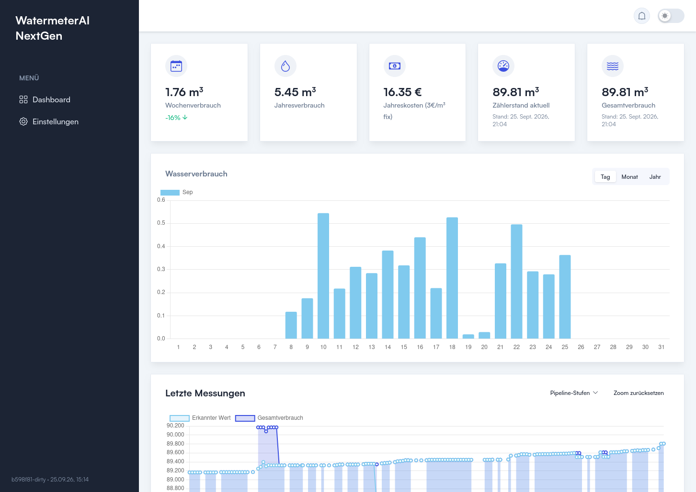
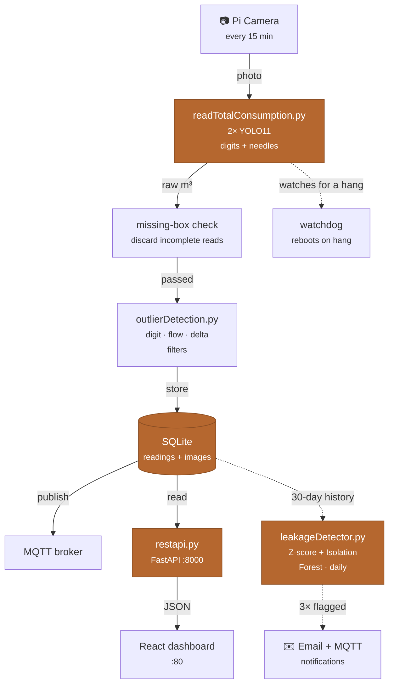
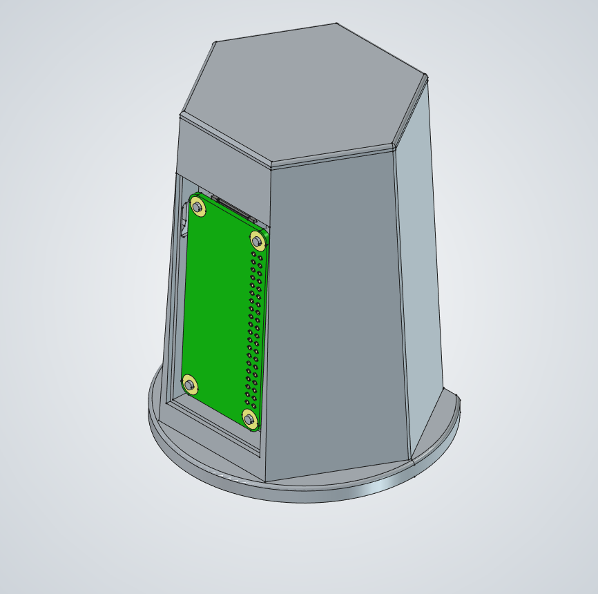

# WatermeterAI NextGen 💧

Turns a photo of an ordinary analog water meter into a continuous digital reading — no smart meter, no retrofit, just a Raspberry Pi, a camera, and a YOLO model reading the dials like a person would.


<p align="center">
  
</p>

Every 15 minutes, a camera photographs the meter's dial face and a pair of YOLO models reads the digit wheels and sweep needles into one cumulative value, which is filtered for outliers, stored, and pushed to a dashboard and MQTT. A nightly job watches the trend for the signature of a leak and emails a warning before it becomes a water bill.

## Credits

Inspired by [jomjol/AI-on-the-edge-device](https://github.com/jomjol/AI-on-the-edge-device), which pioneered reading analog utility meters with on-device ML on an ESP32. WatermeterAI NextGen takes a different path: a Raspberry Pi's extra headroom, YOLO object detection instead of digit-segment classification, and a camera/LED geometry that avoids glare — aiming for accurate readings straight out of the box, with no per-install calibration.

## Contents

- [WatermeterAI NextGen 💧](#watermeterai-nextgen-)
  - [Credits](#credits)
  - [Contents](#contents)
  - [How it works](#how-it-works)
  - [Model training](#model-training)
  - [Repository layout](#repository-layout)
  - [Hardware](#hardware)
    - [What it costs](#what-it-costs)
  - [Installation](#installation)
  - [Local development](#local-development)
    - [Verifying a deploy](#verifying-a-deploy)
  - [Configuration reference](#configuration-reference)
  - [Leak detection](#leak-detection)
  - [Known limitations](#known-limitations)
  - [License](#license)

## How it works



*Solid arrows run every 15 minutes; dashed arrows (leak detector) run nightly and only speak up after three consecutive flagged days. A watchdog reboots the Pi if a run ever hangs.*

**Reading pipeline.** Two YOLO11 models read the digit wheels and sweep needles into a cumulative m³ value; a red-pixel check locates the decimal point, since the fractional wheels are printed red.

**Outlier filtering.** A missing-box check discards incomplete frames outright. Accepted values then pass missing-digit, max-flow (rate + absolute cap), and negative-delta filters — a single bad reading falls back to the local median, but a sustained run of consistent higher readings is accepted as real (e.g. a pipe burst) and triggers a notification instead of being clamped forever.

**Storage and delivery.** Readings, images, and every intermediate pipeline value land in SQLite, publish to MQTT, and are served by FastAPI to the React dashboard. Developer mode exposes each pipeline stage as its own chart line.

## Model training

The two YOLO11 models in `backend/models/` were trained on **3,516 images** from several sources — web photos, synthetically generated dials, and composited images — to cover a wide range of meter appearances, lighting, and angles, so the model doesn't overfit to one setup.

| Model | Task | Precision | Recall | mAP50 | mAP50-95 | Epochs |
|---|---|---|---|---|---|---|
| `totalandneedles/best.pt` | Needle position + counter-area detection | 0.894 | 0.882 | 0.906 | 0.852 | 100 |
| `digits/best.pt` | Digit-wheel detection (0–9 + red/transition class) | 0.964 | 0.908 | 0.948 | 0.826 | 100 |

The higher digit-detection precision (0.96 vs. 0.89) reflects that digit wheels are a more visually consistent target than needle position, which varies more geometrically across meter models. The two models' errors are largely independent, which is part of why the outlier filters downstream catch what either model gets wrong on its own.

If retraining for a different meter design, keep the same split (needles/counter-area vs. digit wheels). Training scripts and the raw dataset aren't included here, but the label format follows standard Ultralytics YOLO conventions — any compatible pipeline (e.g. [Roboflow](https://roboflow.com) or local [Ultralytics](https://docs.ultralytics.com/)) will work.

## Repository layout

| Path | What lives there |
|---|---|
| `backend/` | FastAPI server, YOLO reading pipeline, leak detector, SQLite models |
| `backend/models/` | Trained YOLO11 weights (digits, needles+counter-area) |
| `backend/tests/` | Pytest suite — pure-function tests + a DB-backed integration test |
| `frontend/` | React + Vite dashboard (readings, charts, settings, notifications) |
| `hardware/led/` | KiCad schematic + PCB for the LED illumination board |
| `mechanics/` | FreeCAD models for the camera/light 3D-printed mounting bracket |
| `setupscript.sh` | Provisions a fresh Pi: swap, services, cron, watchdog, `.env` |

## Hardware

`Raspberry Pi Zero 2 W (or better)` · `Pi Camera Module` · `Custom LED light (KiCad)` · `3D-printed mount (FreeCAD)`

<p align="center">
  
</p>

The camera and a custom LED light source (schematic/PCB in [`hardware/led/`](hardware/led/)) sit inside a 3D-printed bracket ([`mechanics/`](mechanics/)) that clips over the meter's glass face — no plumbing work, no meter replacement. Camera and LED are offset from each other at an angle chosen so the glass's specular reflection is thrown away from the camera instead of back into it, which is the single biggest source of misreads.

### What it costs

The compute and imaging side is deliberately cheap — accuracy comes from the YOLO models and lighting, not the hardware:

| Part | Price |
| --- | --- |
| Raspberry Pi Zero 2 W | ~€20 / $15 |
| Camera module (e.g. RPIZ-CAM-GS) | ~€15 |
| **Total (board + camera)** | **~€35 / ~$40** |

Add a power supply, SD card, the LED board, and a printed bracket (see [`hardware/`](hardware/) and [`mechanics/`](mechanics/)) and you're realistically still under €50 all in. Prices fluctuate by retailer; check current listings.

> **Reproducing the hardware:** PCB and enclosure files are provided as-is. You'll need KiCad for `hardware/led/led.kicad_pcb` and FreeCAD for the `mechanics/*.FCStd` models — expect to adapt the bracket geometry, since glass diameter/depth vary by meter manufacturer.

## Installation

The intended target is a fresh Raspberry Pi OS install (Bullseye or newer, 64-bit recommended for `torch`/`ultralytics`).

```bash
git clone <this-repo-url> watermeter
cd watermeter
sudo bash setupscript.sh
```

`setupscript.sh` is idempotent-ish but not fully — read it before running it twice. It will:

1. Increase swap to 2 GB (YOLO inference is memory-hungry on a Pi Zero 2)
2. Install system packages (`python3-picamera2`, `zbar-tools`, `npm`, `watchdog`)
3. Create a Python venv and install the pinned backend dependencies
4. Write `/home/admin/watermeter/.env` with the paths the backend expects
5. Register two `systemd` services and three cron jobs (measurement every 15 min, leak check nightly, DB cleanup nightly)
6. Configure a hardware watchdog that reboots the Pi if the reading log goes stale

Build the frontend once, so the systemd service has something to serve:

```bash
cd frontend
npm install
npm run build   # outputs to frontend/dist, served by `serve` on :80
```

On first boot with no WiFi configured, `backend/wifi.py` waits for a WiFi-credentials QR code (printed on a router, or from any "share WiFi" phone feature) to be shown to the camera — no keyboard or monitor needed.

## Local development

No Pi or camera needed to work on the dashboard/API — `requirements.txt` covers everything else:

```bash
cd backend
python3 -m venv .venv && source .venv/bin/activate
pip install -r requirements.txt

cp .env.example watermeter/.env   # see Configuration reference below
python seed_dev_data.py           # optional: populate SQLite with sample readings
python restapi.py                 # → http://localhost:8000/api/v1
```

```bash
cd frontend
npm install
npm run dev                       # → http://localhost:5173
```

Run the test suite with:

```bash
cd backend
pytest
```

`requirements-pi.txt` (`ultralytics`, `torch`, `opencv-python`, `pyzbar`, `Pillow`) is only needed for the actual image-reading pipeline, on hardware that can run YOLO inference.

### Verifying a deploy

Every frontend build stamps itself with its short git commit hash (`git rev-parse --short HEAD` in [`frontend/vite.config.js`](frontend/vite.config.js), plus `-dirty` for uncommitted changes), shown at the bottom of the dashboard sidebar — compare it against your local `git rev-parse --short HEAD` after `deploy.sh` to confirm the Pi picked up the latest build.

## Configuration reference

Install-specific config lives in two places, both deliberately excluded from version control:

| File | Holds | Set by |
|---|---|---|
| `watermeter/.env` | Filesystem paths — DB file, image folder, log folder, model weight paths | `setupscript.sh` on install |
| `data/settings.json` | MQTT broker credentials, SMTP credentials | Dashboard's Settings page, or manually on first run |

> **Network exposure:** The REST API has permissive CORS and no authentication — built for a trusted home LAN. Don't port-forward `:8000`/`:80` without a reverse proxy and auth in front.

## Leak detection

`leakageDetector.py` runs nightly and combines three independent signals, since a slow leak, a stuck-open valve, and a burst pipe each look different in the reading history:

| Check | Catches | How |
|---|---|---|
| Rest-period check | Flow that never fully stops in 24h | Looks for any window where consecutive readings stay within an adaptive noise threshold |
| Z-score model | A quiet-hour slot (e.g. 3am) running unusually high | Compares each time-of-day slot's rolling 30-min sum against its own 30-day distribution |
| Isolation Forest | Unusual combinations — steady flow at an odd hour, an odd-sized single spike | Unsupervised model trained on flow, streak length, and time-of-day features |

A single flagged night doesn't trigger a warning — three consecutive nights do, trading a day or two of latency for not emailing you every time the dishwasher runs at an odd hour.

## Known limitations

- Reading accuracy depends on consistent lighting and a clean meter face — condensation, dirt, or an off-angle mount degrades YOLO's confidence.
- The bundled models were trained on one meter's dial design; a differently styled meter will likely need retraining.
- No authentication on the API or dashboard — see the CORS callout above.
- The Pi Zero 2 W is workable but slow for inference; a Pi 4/5 gives noticeably faster latency.

## License

Backend and hardware design files: MIT — see [`LICENSE`](LICENSE).

The frontend is built on [Reactwind](https://github.com/imarpanpatra/Reactwind) by Arpan Patra, also MIT-licensed — see [`frontend/LICENSE.md`](frontend/LICENSE.md) for its original attribution.

---

Built around one household's water meter. Pull requests that make it work with more meter styles, or that harden the network story, are welcome.
